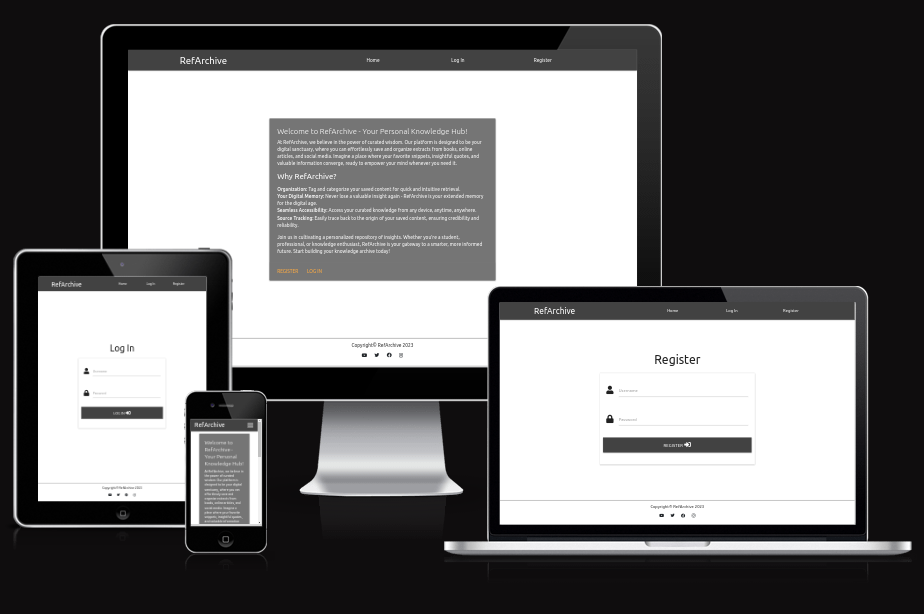
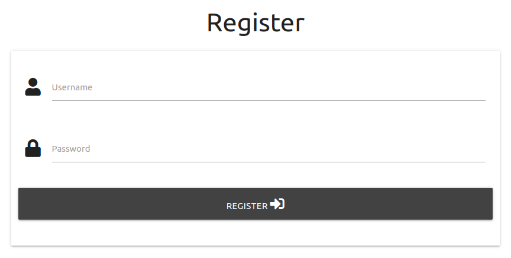
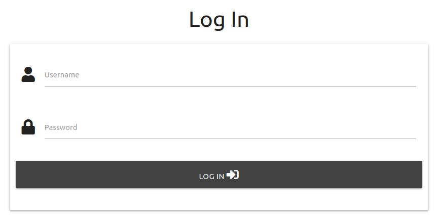
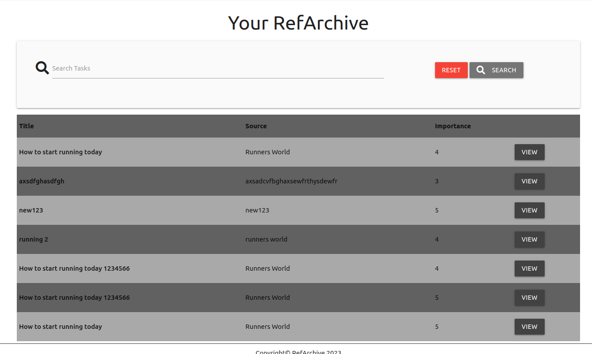
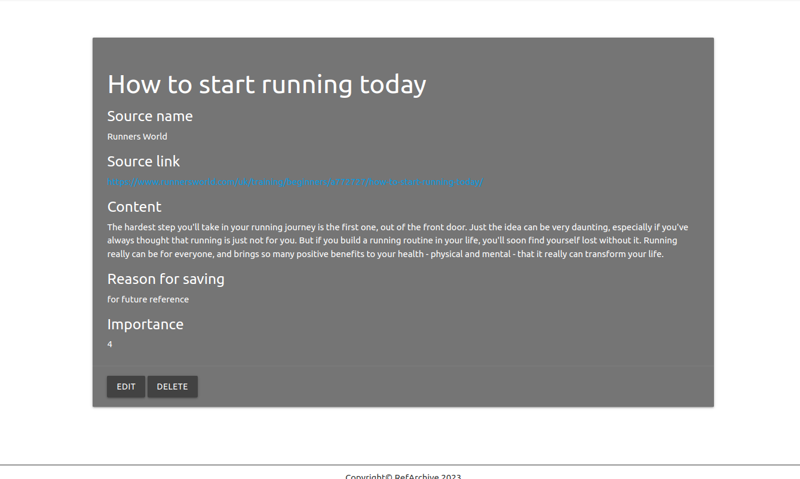
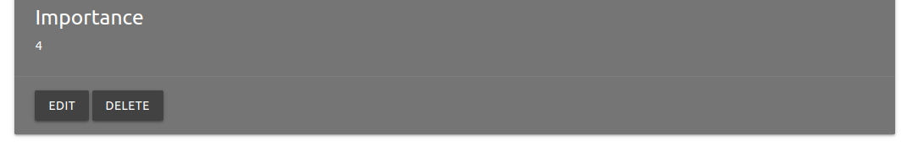
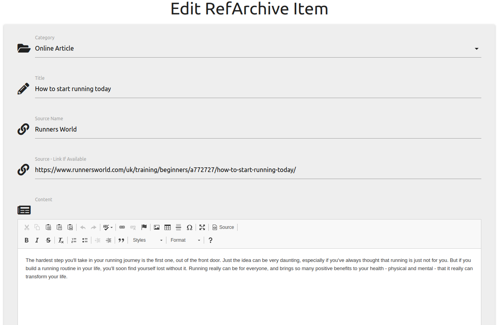
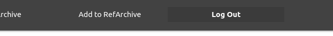

# RefArchive

RefArchive is a web platform dedicated to empowering users with a personalized knowledge repository. Easily save and organize extracts from books, online articles, and videos for quick access to valuable information. With seamless organization, source tracking, and accessibility across devices, RefArchive is your digital memory and gateway to a smarter, more informed future.

[View RefArchive on Heroku](https://ref-archive-b7110f3b2973.herokuapp.com/)

## UX

RefArchive is designed for accessibility and ease of use, it has a clean layout with a simple colour palette.

### Colour Scheme

The colour sceme was created using colours in the Materialize framework Using contrasting shades of grey with white background and text. In some places black or dark grey text is used to stand out from a light grey background. 

### Typography

- [sans-serif] fonts from Materialize

## User Stories

### New Site Users

- As a new site user, I would like to easily create an account to start curating my knowledge.
- As a new site user, I would like to be able to navigate the site with ease.
- As a new user, I would like to easily add new content to my archive.

### Returning Site Users

- As a returning user, I would like to effortlessly log in to access my previously saved content.
- As a returning user, I would like to easily add new content to my archive and update existing entries.
- As a returning user, I would like to quickly search through my saved items to find what I need.

## Wireframes

I've used [Balsamiq](https://balsamiq.com/wireframes) to design my site wireframes.

### Wireframes

| Device | Screenshot |
| --- | --- |
| Mobile |  |
| Tablet |  |
| Desktop |  |

## Structure

### Existing Features

- **Navigation bar**

    - The navigation bar allows the user to easily navigate the site.

- **Registration Page**

    - The registration page allows the user to set up an account.

- **Log In Page**

    - The log in page allows the user to login to their account.

- **Your RefArchive Page**

    - The Your RefArchive page allows the user to quickly view and search their saved items.

- **Add Archive Page**

    - The Add Archive page allows the user to add items to their archive.

- **Detailed View Page**

    - The detailed view page allows the user to view all the details and content of the selected item.

- **Detailed View - Delete**

    - The Delete button on the Detailed View page allows the used to delete items they no longer require.

- **Edit Archive**

    - The Edit Archive page allows the user to update saved items it is accessed by clicking edit on the Detailed View page..

- **Log Out**

    - The log out link in the menu allows the user to quickly log out of the site.

## Tools & Technologies Used

- [HTML](https://en.wikipedia.org/wiki/HTML) used for the main site content.
- [CSS](https://en.wikipedia.org/wiki/CSS) used for the main site design and layout.
- [JavaScript](https://www.javascript.com) used for user interaction on the site.
- [Python](https://www.python.org/) used for backend coding.
- [Flask](https://flask.palletsprojects.com/en/3.0.x/) used as a python framework for the site.
- [Git](https://git-scm.com) used for version control. (`git add`, `git commit`, `git push`)
- [GitHub](https://github.com) used for secure online code storage.
- [Heroku](https://www.heroku.com/) used for hosting the deployed front-end site.
- [Gitpod](https://gitpod.io) used as a cloud-based IDE for development.
- [JSHint](https://jshint.com/) - used to validate JS code.
- [W3 HTML validator](https://validator.w3.org/nu/) - used to validate HTML.
- [W3 Jigsaw](https://jigsaw.w3.org/css-validator/validator) - used to validate CSS.
- [AmIResponsive?](https://ui.dev/amiresponsive?url=https://ref-archive-b7110f3b2973.herokuapp.com) - used to create AmIResponsive image for README.md
- [Balsamiq](https://balsamiq.com/wireframes/) - used to create wireframes during project planning.

## Testing

For all testing, please refer to the [TESTING.md](TESTING.md) file.

## Deployment

The site was deployed to Heroku. The steps to deploy are as follows:
1. Log in to Heroku - or set up a new account.
2. From the dashboard, click 'Create new app'.
3. Name your app - it will need to be unique. Select Region, then 'Create'.
4. Click on the 'Settings' tab.
5. Scroll down to Config Vars and click 'Reveal Config Vars'.
6. In the 'Key' field enter 'PORT', and in the 'Value' field enter '8000'.
7. If there is a credentials file, this will also need to be entered into the Config Vars setting.
8. Staying within 'Settings', scroll down to Buildpacks and click on 'Add Buildpacks'.
9. Select 'python' first and click 'Save changes'.
10. Then do the same again and this time select 'nodejs' and click 'Save changes'.
11. Ensure the buildpacks are in the order of python first and nodejs second. 
12. Scroll to the top and select 'Deploy'.
13. In 'Deployment method' select 'GitHub' and confirm you want to connect.
14. Enter your GitHub repository into the search bar, and then 'Connect'.
15. Under 'Automatic deploys', click on 'Enable Automatic Deploys' if you want the app to update every time you push changes to GitHub.
16. Finally, click on 'Deploy Branch' under 'Manual deploy' to deploy your app. Once completed, you will be able to view your deployed link.

### Local Deployment

This project can be cloned or forked in order to make a local copy on your own system.

#### Cloning

You can clone the repository by following these steps:

1. Go to the [GitHub repository](https://github.com/treggs1/p3-RefArchive) 
2. Locate the Code button above the list of files and click it 
3. Select if you prefer to clone using HTTPS, SSH, or GitHub CLI and click the copy button to copy the URL to your clipboard
4. Open Git Bash or Terminal
5. Change the current working directory to the one where you want the cloned directory
6. In your IDE Terminal, type the following command to clone my repository:
	- `git clone https://github.com/treggs1/p3-RefArchive.git`
7. Press Enter to create your local clone.

Alternatively, if using Gitpod, you can click below to create your own workspace using this repository.

Please note that in order to directly open the project in Gitpod, you need to have the browser extension installed.
A tutorial on how to do that can be found [here](https://www.gitpod.io/docs/configure/user-settings/browser-extension).

#### Forking

By forking the GitHub Repository, we make a copy of the original repository on our GitHub account to view and/or make changes without affecting the original owner's repository.
You can fork this repository by using the following steps:

1. Log in to GitHub and locate the [GitHub Repository](https://github.com/treggs1/p3-RefArchive)
2. At the top of the Repository (not top of page) just above the "Settings" Button on the menu, locate the "Fork" Button.
3. Once clicked, you should now have a copy of the original repository in your own GitHub account!

## Credits

### Content

| Source | Location | Notes |
| --- | --- | --- |
| [Markdown Builder](https://traveltimn.github.io/markdown-builder) | README and TESTING | tool to help generate the Markdown files | 
