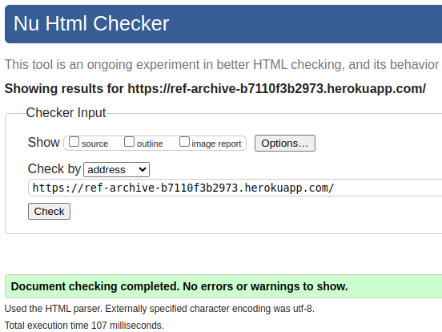
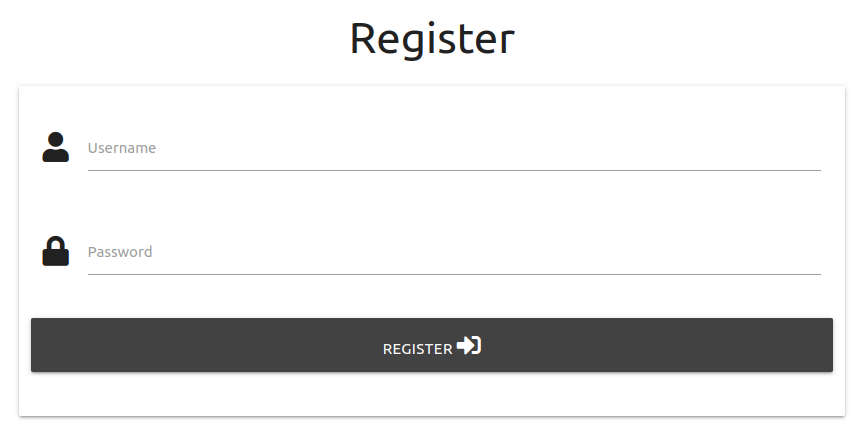
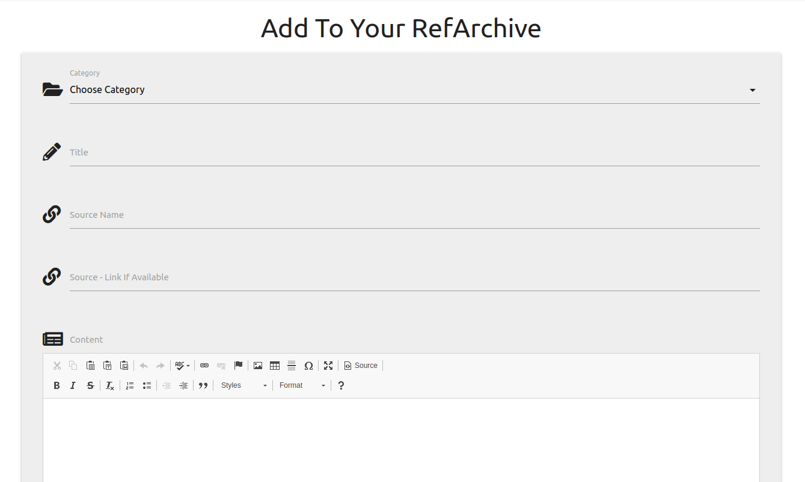

# Testing

Return back to the [README.md](README.md) file.

In this section, I will present proof to demonstrate that:
- The project **features** work as intended
- The **users** can achieve their goals
- The project is **responsive** across different devices and screen sizes
- The project is **compatible** across different web browsers
- The project uses **valid code** according to standard practice
- The project passes audits for **performance, accessibility, best practices and SEO** (using Lighthouse by Chrome Developer Tools)

## Code Validation

I will use this space to discuss code validation of my code files (where applicable).

### HTML

I have used the recommended [HTML W3C Validator](https://validator.w3.org) to validate the home page as the majority of the html is stored in the base.html and the validator cant access all pages I did also run it on the Your RefArchive page by pasting in the code to the W3C Validator and it showed no errors.

| Page | W3C URL | Screenshot | Notes |
| --- | --- | --- | --- |
| Home | [W3C](https://validator.w3.org/nu/?doc=https%3A%2F%2Fref-archive-b7110f3b2973.herokuapp.com%2F) |  | Pass: No Errors |

### CSS

I have used the recommended [CSS Jigsaw Validator](https://jigsaw.w3.org/css-validator) to validate all of my CSS files, my css files show no errors how ever Materialize CSS has 1 warning and multiple errors.

| File | Jigsaw URL | Screenshot | Notes |
| --- | --- | --- | --- |
| style.css | [Jigsaw](https://jigsaw.w3.org/css-validator/validator?uri=https%3A%2F%2Fref-archive-b7110f3b2973.herokuapp.com%2F&profile=css3svg&usermedium=all&warning=1&vextwarning=&lang=en) |  | Pass: No Internal Errors |

### JavaScript

I have used the recommended [JShint Validator](https://jshint.com) to validate all of my JS files and also [Esprima](https://esprima.org/demo/validate.html) to check for any syntax errors.

| File | Validator Tool |Screenshot | Notes |
| --- | --- | --- | --- |
| script.js | [JSHint](https://jshint.com/) | | Pass: no errors |

## Browser Compatibility

I've tested my deployed project on multiple browsers to check for compatibility issues.

| Browser | Screenshot | Notes |
| --- | --- | --- |
| Chrome |  | Works as expected |
| Firefox |  | Works as expected |
| Edge |  | Works as expected |

## Responsiveness

I've tested my deployed project on multiple devices to check for responsiveness issues.

| Device | Screenshot | Notes |
| --- | --- | --- |
| Mobile (DevTools) |  | Works as expected |
| Tablet (DevTools) |  | Works as expected |
| Desktop |  | Works as expected |
| Asus ROG Phone 5 (Android) |  | Works as expected |

## Lighthouse Audit

I've tested my deployed project using the Lighthouse Audit tool to check for any major issues.

| Page | Size | Screenshot | Notes |
| --- | --- | --- | --- |
| Home | Mobile |  | 1 warning about heading elements order and PWA warnings |
| Home | Desktop |  | 1 warning about heading elements order and PWA warnings |

## Defensive Programming

Defensive programming was manually tested with the below user acceptance testing:

| Page | User Action | Expected Result | Pass/Fail | Comments |
| --- | --- | --- | --- | --- |
| Home Page | | | | |
| | Click on Menu Item | All menu links goto the correct location | Pass | |
| Login Page | | | | |
| | Attempt to login | If you use the correct details it will login and if not user will get feedback | Pass | |
| Registration Page | | | | |
| | Attempt to register | If the username is unique and the username and password match the criteria it will create account and login otherwise the user will receive feedback| Pass | |
| Add Archive Page | | | | |
| | Shows the user a form where they can input the data they want to save and upon clicking add to refarchive button it iserts the data into the database| Pass | |
| Your Archive Page | | | | |
| |  | Page displays users archive as expected showing search feature and view button for the user to view the full details of their saved item| Pass | |
| | Using search | Entering a search query correctly brings up results if there are any to show| Pass | |
| | Clicking view on item | Brings up the full details of the item saved| Pass | |
| Detailed View | | | | |
| |  | Shows the full details of the item the user has selected and gives them the option to delete or edit the item| Pass | |
| | Clicking Delete | Deletes the item from database| Pass | |
| Edit Item | | | | |
| |  | Shows form with all the data for the current item and changesd the data and clicks save changes then it updates the data in database| Pass | |

## User Story Testing

| User Story | Screenshot |
| --- | --- |
| As a new site user, I would like to easily create an account to start curating my knowledge. |  |
| As a new site user, I would like to be able to navigate the site with ease. |  |
| As a new user, I would like to easily add new content to my archive. |  |
| As a returning user, I would like to effortlessly log in to access my previously saved content. |  |
| As a returning user, I would like to easily add new content to my archive and update existing entries. |  |
| As a returning user, I would like to quickly search through my saved items to find what I need. |  |